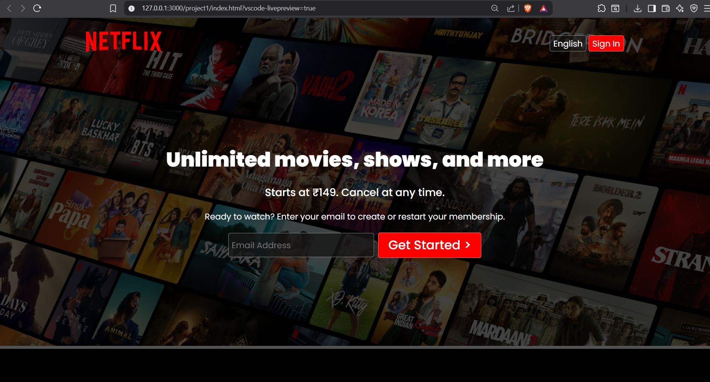
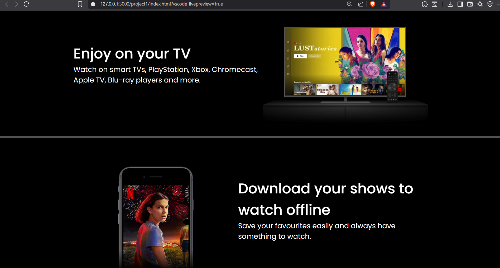
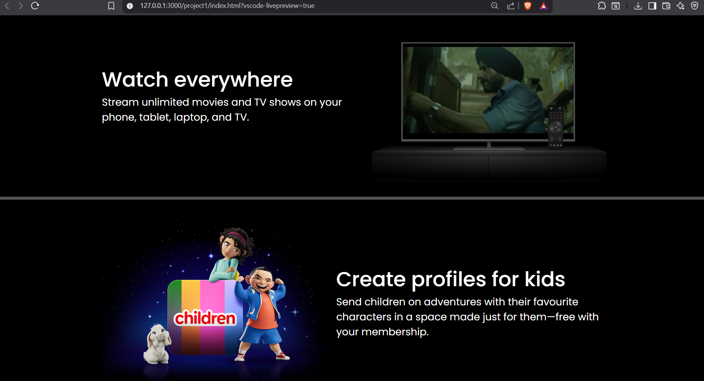
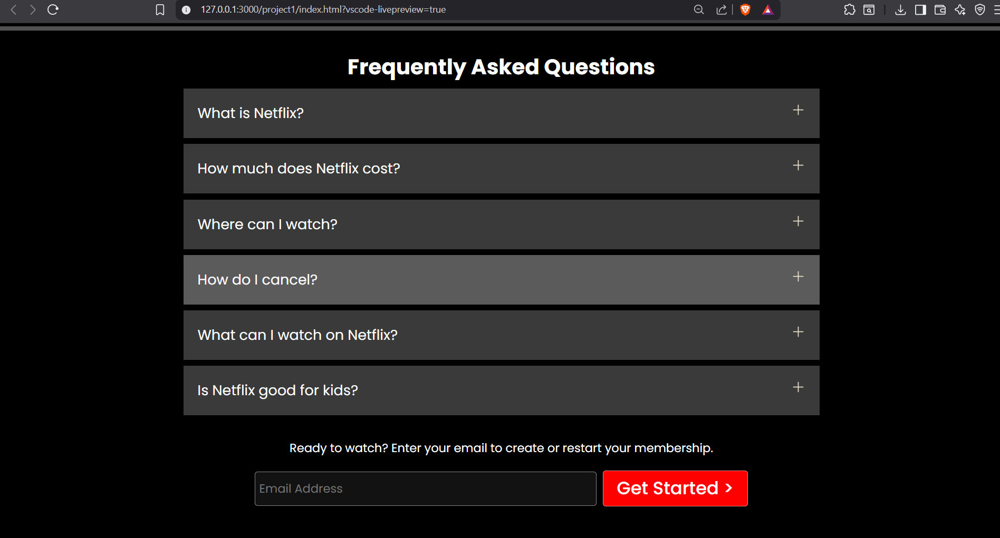
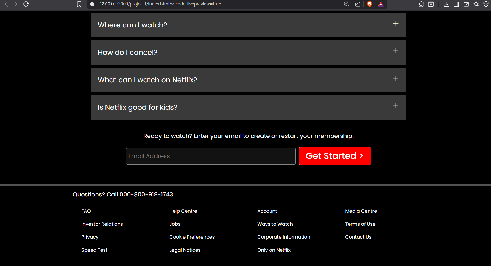

# 🌐 Web Development Course

<div align="center">


**A personal learning journal documenting my journey through web development — from writing my first HTML tag to building real projects with JavaScript.**

</div>

---

## 🧭 Overview

This repository serves as my **course progress tracker** as I learn the core building blocks of modern web development. Each folder represents a module I've worked through, with practice files, experiments, and notes inside.

Whether you're a fellow beginner or just curious about where to start with web dev — feel free to explore!

---

## 📁 Repository Structure

```
Web_Development_Course/
│
├── 📄 Html intro/            → HTML fundamentals: tags, elements, forms, structure
├── 🎨 CSS intro/             → CSS basics: selectors, box model, colors, layouts
├── ⚡ JavaScripts intro/     → JS fundamentals: variables, functions, DOM, events
├── 🚀 project1/              → First real-world mini project (HTML + CSS)
├── 🧪 testing/               → Sandbox: playground for experiments & new ideas
└── ⚙️  .vscode/               → Editor config for a smooth dev experience
```

---

## 📚 What I'm Learning

### 🏗️ HTML — The Skeleton
- Semantic elements: `<header>`, `<main>`, `<section>`, `<footer>`
- Text, headings, lists, links, and images
- Forms, inputs, buttons, and tables
- Embedding media and structuring content

### 🎨 CSS — The Skin
- Selectors, specificity, and the cascade
- Box model: margin, padding, border
- Typography, colors, backgrounds
- Flexbox for modern layouts
- Hover effects and basic animations

### ⚡ JavaScript — The Brain
- Variables (`let`, `const`), data types, operators
- Functions, conditionals (`if/else`), loops
- DOM manipulation — selecting and changing elements
- Event listeners — making pages interactive
- Debugging with browser DevTools

---

## 🚀 Projects

### 📌 Project 1 — Mini Web App
> Located in `/project1`

My first complete project built by combining everything learned in the HTML,& CSS. A practical exercise in putting the fundamentals together into something real and functional.

### 📸 Screenshots

#### web app screenshot 1


#### web app screenshot 2


#### web app screenshot 3


#### web app screenshot 4


#### web app screenshot 5


---

## ✅ Progress Tracker

| Topic | Status |
|-------|--------|
| HTML Basics | ✅ Done |
| CSS Basics | ✅ Done |
| JavaScript Basics | ✅ Done |
| First Project | ✅ Done |
| Responsive Design | ✅ Done |
| Advanced JS (ES6+) | ⏳ Planned |
| Frontend Framework (React) | ⏳ Planned |
| Deployment & Hosting | ⏳ Planned |

---

## 💡 Key Takeaways So Far

- HTML gives a webpage its **structure**
- CSS gives it **style and personality**
- JavaScript brings it to **life with interactivity**
- The three work together seamlessly — and mastering the basics is the foundation of everything in web development

---

## 📈 What's Next

- [ ] Responsive design with media queries
- [ ] CSS Grid for advanced layouts
- [ ] ES6+ JavaScript features (arrow functions, promises, async/await)
- [ ] Build more real-world projects
- [ ] Explore React.js

---

## 🙌 Acknowledgements

Thanks to the course instructors and the open web dev community — Stack Overflow, MDN Web Docs, and countless YouTube tutorials that helped make sense of the tricky bits.
